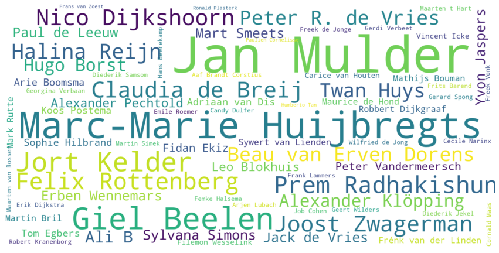
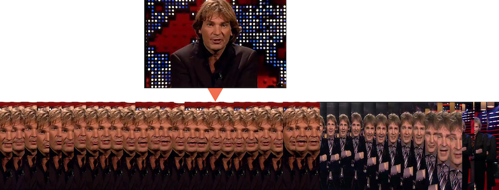

**2005-2020, einde van een tijdperk: De Wereld Draait Door stopt na 15 jaar. DWDD is een van de populairste programma’s op de Nederlandse televisie. Kijk mee naar 15 jaar tv-geschiedenis door de ogen van het Beeld en Geluid-archief, mogelijk gemaakt door [Media Suite](https://mediasuite.clariah.nl/).**

Kenmerkend voor het programma is het hoge tempo waarin onderwerpen elkaar afwisselen en het brede scala aan onderwerpen dat ter tafel komt. Marc-Marie Huijbregts over zijn samenwerking met DWDD: “Het begon als een vergissing, zoals eigenlijk alles in mijn leven.” In een uitzending in 2009 nam hij afscheid van zijn ‘cavia’ en ging vanaf toen kaal door het leven. “Tafelheer bij DWDD is wel mijn favoriete baan, als alles mag en niks moet.”

<iframe src='https://public.flourish.studio/visualisation/1625100/embed' frameborder='0' scrolling='no' style='width:100%;height:530px;'></iframe>

*[figure needs caption]*

Het meest invloedrijk is DWDD waarschijnlijk geweest met ingewikkelde materie toegankelijk maken voor een breed publiek. The DWDD University will be missed! is een veel geziene reactie bij het nieuws. Zo legt Robert Dijkgraaf in Jip en Janneke-taal uit wat de oerknal inhoudt en kunnen we de volgende dag meepraten over technologische ontwikkelingen na een item met Alexander Klöpping. En wie wist vóór DWDD wie Alexander Klöpping, Akwasi of Özcan Akyol was?

 
*[Explicitly annotated guests]*

<iframe src='https://public.flourish.studio/visualisation/1625272/embed' frameborder='0' scrolling='no' style='width:100%;height:530px;'></iframe>

*[figure needs caption]*

DWDD besteedt ruim aandacht aan cultuur. Live gedichten door Nico Dijkshoorn, de vaste huisband. Klassiekers in een nieuw jasje met de DWDD Recordings. Zo zet ook acteurs, schrijvers, bands en singer songwriters op de kaart. DWDD recordings [..] Besproken ‘Boeken van de Maand’ werden bestsellers [...]
Halina Reijn deelt bij het 5-jarige jubileum hoe blij ze is dat DWDD acteurs en theatermakers op de kaart heeft gezet. “Matthijs is een uniek persoon, die met nieuwsgierig en passie mensen ondervraagd en hij is altijd en heel positief, heel on-Nederlands,” aldus de actrice.

Hoewel er verschillende andere presentatoren de revue passeerden (Francisco van Jole, Claudia de Breij, Joost Karhof) is de populariteit van het programma vooral te danken aan Matthijs van Nieuwkerk. Hij is “verbaal behendig, vloeiend en dwingend en zijn stijl gedistingeerd en nonchalant,” aldus Genootschap Onze Taal. “Dat laatste komt ook tot uitdrukking in zijn kleding: hij draagt altijd een pak dat net een paar maten te klein is.” 

*[Haakje. Iets over deze timeframe.] Beweeg je cursor over deze tijdlijn en zie hoe het DWDD openingsshot met Matthijs van Nieuwkerk door de jaren heen veranderd is. Hoeveel grijze haren of rimpels kreeg Matthijs van Nieuwkerk er door de jaren heen bij? [...]*

<iframe src='https://public.flourish.studio/visualisation/1472683/embed' frameborder='0' scrolling='no' style='width:100%;height:530px;'></iframe>

## Een van de invloedrijkste en populairste programma’s in de Nederlandse tv-geschiedenis. Waarom?

**Matthijs presentator** -  1169 keer, dan volgen Claudia de Breij met 57 en Francisco van Jole met 23. Maar... de presentator wordt vaak niet aangeven, staat vaak op seizoensniveau

<iframe src='https://public.flourish.studio/visualisation/1522615/embed' frameborder='0' scrolling='no' style='width:100%;height:530px;'></iframe>

*(om nog te updaten zodat het door gaat tot nu)*

## Powered by Media Suite

Er zitten schatten aan informatie in het archief van Beeld en Geluid, niet alleen tastbaar, maar ook in de metadata. Informatie over informatie. Met de Media Suite kunnen we metadata [uitleggen wat we precies doen]
 
Vanaf 2005 kunnen we data afleiden uit … Vanaf 2014 gaat het via spraakherkenning en analyse van ondertiteling. Hoe kunnen we bijvoorbeeld het verschil zien tussen een genodigde van DWDD en iemand die besproken wordt in een clip? Voor grote lijnen maakt het niet zoveel uit. Je ziet dat door de jaren heen de manier van metadata invoeren is veranderd. [...]
 
De Media Suite is een online omgeving, ontwikkeld door CLARIAH en Beeld en Geluid. Deze omgeving maakt het mogelijk onderzoek uit te voeren met grootschalige multimediale erfgoedcollecties.

- Nog verder uitwerken Top 5 kijkcijfers (via poll?)
- Best bekeken uitzending linkje met corona
- Nog verder uitwerken, indien mogelijk: Corona data viz

Was het altijd gezellig in de studio? Nee, zo had Matthijs van Nieuwkerk ook wel eens een aanvaring. Peter R. de Vries, Frits Spits. Rob Oudkerk [voorbeelden]

27 maart is/was echt de laatste uitzending. Aan alles komt een eind, maar vergeet niet: de wereld draait doorrrrrrrrrrrrrrr...